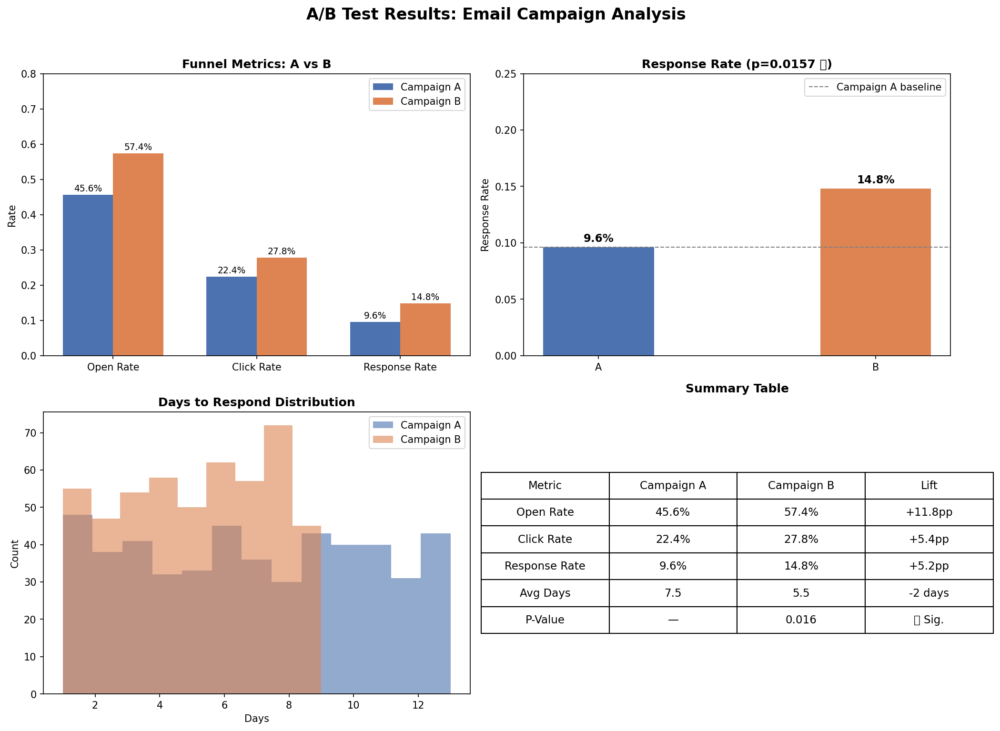

# A/B Testing: Email Marketing Campaign Analysis

## Overview
Statistical analysis of two email marketing campaigns to determine 
which drives higher candidate response rates using hypothesis testing.

## Business Question
> Does Campaign B generate a statistically significantly higher 
> response rate than Campaign A?

## Key Finding
**Yes.** Campaign B outperforms Campaign A with a p-value of 0.016,
representing a 54% lift in response rate.

## Results

| Metric         | Campaign A | Campaign B | Lift     |
|----------------|------------|------------|----------|
| Open Rate      | 45.6%      | 57.4%      | +11.8pp  |
| Click Rate     | 22.4%      | 27.8%      | +5.4pp   |
| Response Rate  | 9.6%       | 14.8%      | +54.2%   |
| Avg Days       | 7.5 days   | 5.5 days   | -2 days  |

**P-Value: 0.016 — Statistically significant at 95% confidence level**

## Visualizations


## Tools & Libraries
- Python
- pandas
- matplotlib / seaborn
- scipy (chi-square test)

## Project Structure
```
ab-testing-marketing-campaigns/
│
├── data/
│   └── campaigns.csv          # Synthetic dataset (1000 rows)
├── notebooks/
│   └── eda.py                 # Exploratory data analysis
├── scripts/
│   ├── generate_data.py       # Data generation script
│   ├── ab_test.py             # Statistical test
│   └── visualize.py           # Charts and visualizations
└── outputs/
    ├── campaign_comparison.png
    └── ab_test_results.png
```

## Methodology
1. Generated synthetic dataset of 1000 candidates (500 per campaign)
2. Performed EDA to understand distributions and baseline metrics
3. Ran chi-square test to determine statistical significance
4. Visualized results across the full conversion funnel

## Conclusion
Campaign B should be rolled out to the full candidate pool.
The 54% lift in response rate is statistically significant and
practically meaningful for pipeline generation.